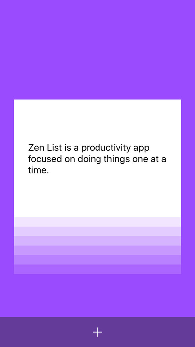
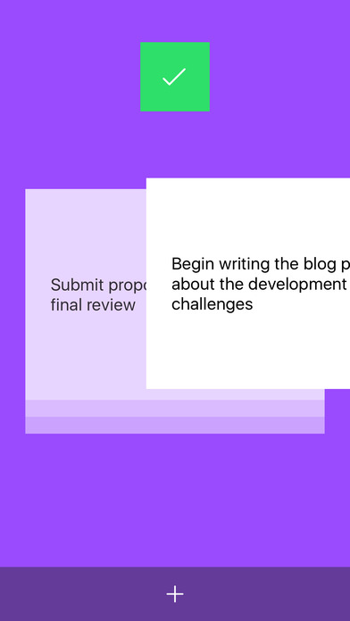
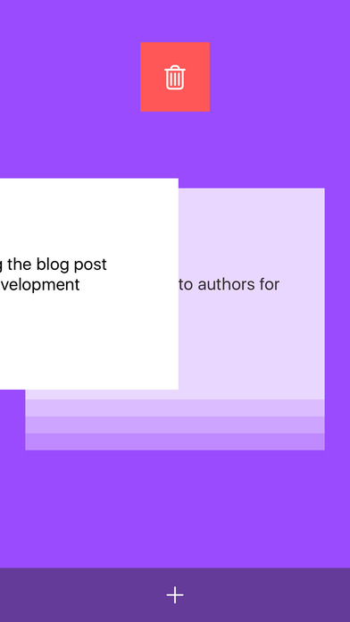
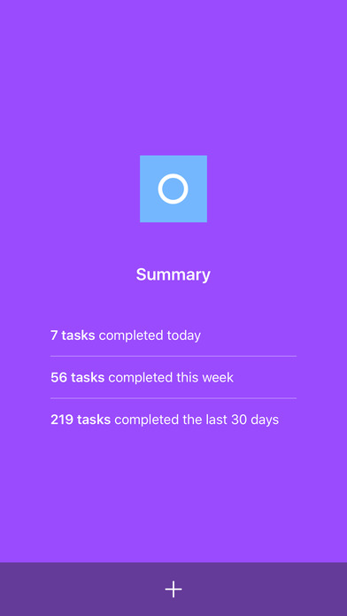

# Zen List

Zen List is on the [app store!](https://itunes.apple.com/us/app/zen-list-tasks-without-distractions/id1146268508?mt=8)

## App Store Description

Zen List is a new type of productivity app to help you commit to getting things done without distractions.

We’ve all been there - our to-do list is overflowing. It’s anxiety-inducing. You don’t know where to start. Your mind is jumping all over the place.

With Zen List, you only deal with one task at a time. You can swipe right to complete the task and swipe left to delete the task. Swipe up to peek at upcoming tasks. Zen List uses a queue to organize your to-dos - you deal with tasks in the order that you created them, one at a time. It's easy to commit to finishing a task and doing it without distractions.

Clear your mind and become more productive than ever.

## Screenshots

